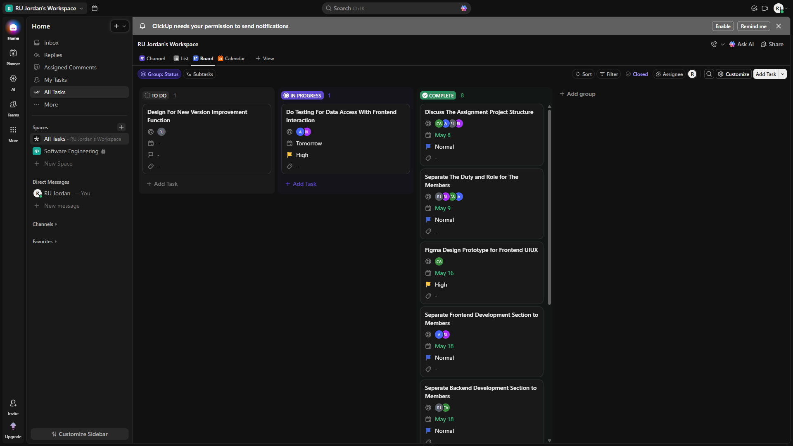
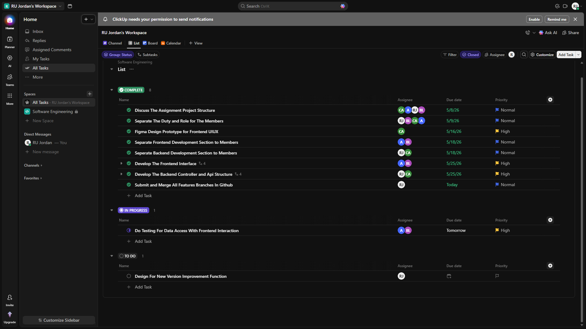
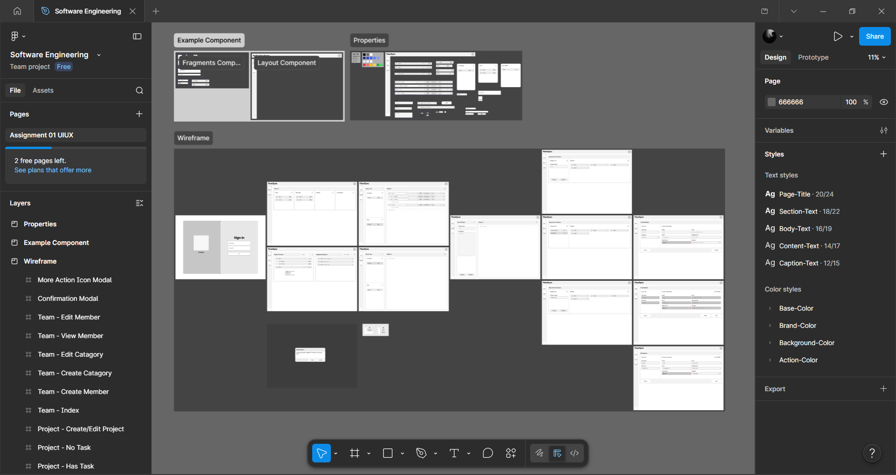
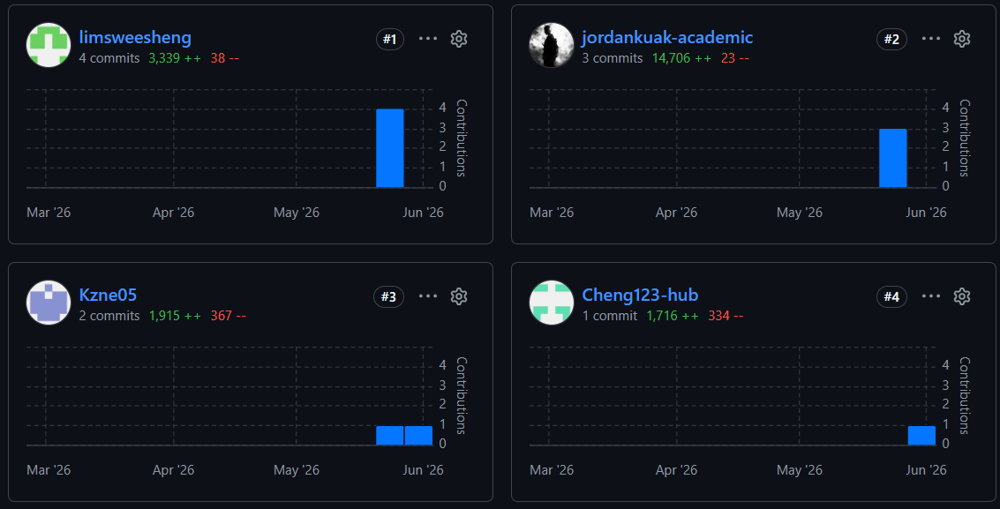
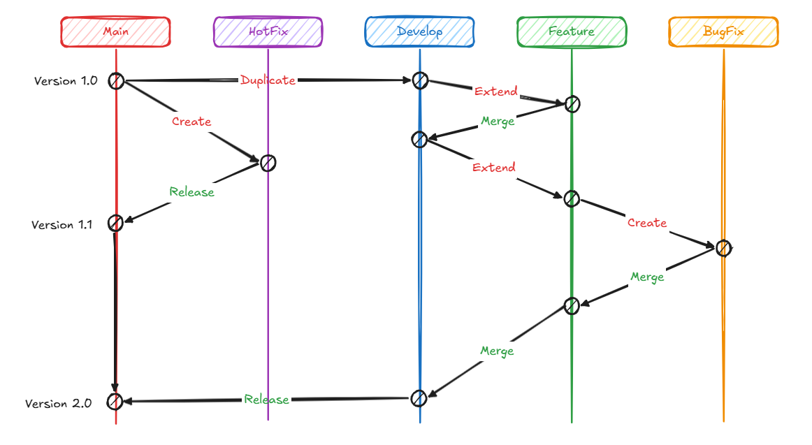

# Company Task Tracker System - FlowSync

A Laravel-based internal task management system designed for tracking projects, departments, teams, and individual tasks within a company. It allows users to create tasks, assign them to team members, set due dates and priorities, and create nested subtasks under any main task — enabling detailed breakdown of complex workflows.

## 👨‍👩‍👧‍👦	Project Contributors Information

### Jordan Kuak Kian Meng

- **Student ID:** BAI_A2009F-2605004
- **Email Address:** jordankuak-academic@gmail.com
- **Role:** Project Leader, Backend Developer, Database Designer
- **Responsibilities:** Lead the project, design the wireframes of the project, structure the database schema.

### Cheng Wei Le

- **Student ID:** BAI_A2009F-2605008
- **Email Address:** cheng.academic123@gmail.com
- **Role:** Backend Developer, UIUX Designer
- **Responsibilities:** Develop the backend features of the project, design the UIUX of the project by using Figma, and coordinate with the team members to ensure the project is delivered on time.

### Lim Swee Sheng

- **Student ID:** BAI_A2009F-2605010
- **Email Address:** limsweesheng@gmail.com
- **Role:** Frontend Developer, Tester
- **Responsibilities:** Develop the frontend features of the project, application the UI design by Wei Le, and merge the data access layer with the backend features.

### Andrew Tan Yan Rui

- **Student ID:** BAI_A2009F-2605005
- **Email Address:** yanrui1216@gmail.com
- **Role:** Frontend Developer, Tester
- **Responsibilities:** Test the frontend features of the project, apply the UI design by Wei Le, and combine the frontend features with the backend features to ensure all the function works as expected.

## 📚 Table of Contents

- [Problem Statement](#problem-statement)
- [Product Vision and Scope](#product-vision-and-scope)
- [System Overview](#system-overview)
- [User Stories](#user-stories)
- [Features Implemented](#features-implemented)
- [Technology Stack](#technology-stack)
- [GitHub Usage](#github-usage)
- [Future Enhancements](#future-enhancements)
- [How to Installing the Project](#how-to-installing-the-project)
- [For Contributors - Features Submission Procedure](#for-official)
- [More Information](#more-information)

## <a id="problem-statement"></a>📌 Problem Statement

**Client Scenario:**

Enterprises face challenges when managing cross-departmental business tasks using traditional methods (e.g., emails, spreadsheets, or isolated tools):

01. Fragmented ownership across departments (Sales, Ops, Finance, Legal)

02. Lack of visibility into task dependencies and progress

03. Difficulty breaking complex business tasks into actionable micro-tasks

04. Delays caused by manual handoffs and status updates

**Business Need:**

Organizations need a centralized task management system that allows teams to:

01. Decompose business-driven tasks into granular, assignable micro-tasks

02. Track end-to-end task lifecycle across departments in real time

03. Automate task dependencies and notifications between teams

04. Ensure accountability with role-based access and audit trails

**Target Users:**

01. Department heads and project leads initiating and overseeing business tasks

02. Cross-functional team members executing micro-tasks (e.g., data entry, review, approval)

03. Executives and operations managers monitoring business throughput and bottlenecks

## <a id="product-vision-and-scope"></a>🎯 Product Vision and Scope

### Vision Statement:

"To provide a centralized, transparent task orchestration platform that enables enterprises to seamlessly decompose business-driven tasks into accountable micro-tasks, eliminate cross-departmental handoff friction, and accelerate operational execution."

### Scope:

✅ **Included (in this version):**

- Create and define top-level business tasks (e.g., "Process customer orders," "New supplier onboarding")

- Break tasks into multi-level microtasks with assignable responsibilities

- Assign microtasks to specific employees

- Task status tracking (e.g., pending, in progress, completed)

❌ **Not Included (in future versions):**

- Automated task assignment based on workload or AI suggestions

- Send real-time notifications via email, Slack, or Teams

- Time tracking or estimated vs. actual work reports

- Gantt charts or advanced portfolio views

- Integration with external CRM, ERP, or HR systems

## <a id="system-overview"></a>📰 System Overview

The Company Task Tracker System is a lightweight web application built with Laravel, Scss, and JavaScript. It provides an intuitive interface for enterprise users to create, decompose, assign, and track business-driven tasks.

**Key Components:**

- **Task Creation Module** - Allows department leads to define top-level business tasks with titles, descriptions, and due dates

- **Micro-Task Decomposition Interface** - Enables breaking complex tasks into hierarchical, assignable micro-tasks with sub-task relationships

- **Validation System** - Ensures all required fields (task name, assignee, status, due date) are completed before saving

- **Task Board Display** - Shows all top-level tasks and their associated micro-tasks in real-time with status indicators (Pending, In Progress, Completed)

## <a id="user-stories"></a>📖 User Stories

| ID | User Story | Priority | Story Points | Status |
| --- | --- | --- | --- | --- |
| US1 | As a department lead, I want to create a top-level business task so that I can initiate cross-departmental workflows | High | 5 | ✅ Complete |
| US2 | As a project coordinator, I want to break a task into multiple micro-tasks so that work can be distributed across teams | High | 8 | ✅ Complete |
| US3 | As a team member, I want to view only the micro-tasks assigned to my department so that I focus on my responsibilities | High | 5 | ✅ Complete |
| US4 | As a task owner, I want to update the status of my micro-task (Not Started, In Progress, Blocked, Completed) so that others can track progress | Medium | 3 | ✅ Complete |
| US5 | As a system, I want to validate required fields before saving so that incomplete tasks are prevented | Medium | 3 | ✅ Complete |
| US6 | As a user, I want to receive clear success/error messages so that I know my action was processed correctly | Low | 2 | ✅ Complete |

**Acceptance Criteria Examples:**

**US1 - Create Top-Level Business Task:**

- Given I am on the task management dashboard

- When I enter a task title, description, and due date

- Then the task should be created and displayed in the task list

- And I should be able to add micro-tasks under it

**US4 - Update Micro-Task Status:**

- Given I am viewing a micro-task assigned to my department

- When I change its status from "In Progress" to "Completed"

- Then the status should update immediately in the display

## <a id="features-implemented"></a>✨ Features Implemented

Our team is using the `KanBan` board to manage the tasks.



All the task in this project is managed in the `KanBan` board. And shown in list form in the dashboard.



Our team using the figma to design a simple wireframe of the system. This prevent any confusion or miscommunication between the team members.



In this phase, we have discuss and design the following features:

- **Login Page**: Allows users to log in to the system with their credentials.
- **Dashboard**: Displays all top-level tasks and their associated micro-tasks in real-time with status indicators (Pending, In Progress, Completed).
- **Task Creation Module**: Allows department leads to define top-level business tasks with titles, assign to members, and set the due dates.
- **Add Member Into Teams**: Allows department leads to add team members to specific teams for handling the tasks.

## <a id="technology-stack"></a>🧰 Technology Stack

| Section | Technology | Version | Description |
| --- | --- | --- | --- |
| Backend | Laravel | 13.8 | PHP web framework for building robust applications |
| Frontend | Blade | - | PHP template engine for building interactive user interfaces |
| Styling | Scss | - | CSS preprocessor for writing maintainable stylesheets |
| Database | MySQL | 8.0 | Relational database for storing application data |
| Version Control | Git | 2.54 | Version control system for tracking code changes and collaborating with developers |

## <a id="github-usage"></a>🔧 GitHub Usage

### Version Control with Git

**Commit History:**

- 10 commits from all the members
- All the commit messages are clear and concise.



**Branching Strategy:**

- **Main Branch**: Always is the stable version code of the project all the adjustments will not direct effect this branch.

- **Hotfix Branch**: Used for fixing critical bugs or security issues that appear in stable version code (main branch) which require immediate attention.

- **Develop Branch**: Used for the contributors to work on the project code. All the contributors will get the latest code from this branch.

- **Feature Branch**: Used for developing new features. All the contributors will merge the code from this branch to the develop branch after the feature is completed.

- **Bugfix Branch**: Used for fixing bugs or issues that appear in the respective feature branch. After the bugfix is completed, the contributors will merge the code from this branch to the respective feature branch.



The image is shown the branching strategy of the project that our team is using.

**Pull Requests:**

- All features merged via Pull Requests.
- All the contributors will review the code before merging it to the develop branch.

## <a id="future-enhancements"></a>🔮 Future Enhancements

- **Permission Access Control:** Implement role-based access control (RBAC) to manage user permissions and access levels.

- **Improve the Teams Module:** Add more features to the teams module such as project manager can create the task for cross department teams to make it more flexible.

- **Analysis:** Add analysis features to track the task progress and performance of the system in visualization form.

## <a id="how-to-installing-the-project"></a>📥 How to Installing the Project

01. Make sure you have installed the required dependencies and environment variables (PHP, Laravel, MySQL, Composer, and Node.js).

02. Clone the repository to your local machine.

```bash
git clone https://github.com/jordankuak-academic/flowsync.git
```

03. Navigate to the project directory.

```bash
cd flowsync
```

04. Install the project dependencies.

```bash
composer install
```
```bash
npm install
```

05. Configure the project environment variables.

```bash
cp .env.example .env
```
```bash
php artisan key:generate
```

06. Setup the database connection in the `.env` file.
```bash
DB_HOST=localhost
DB_PORT=3306
DB_DATABASE=flowsync
DB_USERNAME=root
DB_PASSWORD=
```

07. Run the database migrations.

```bash
php artisan migrate
```
```bash
php artisan db:seed
```

08. Compile the frontend resources.

```bash
npm run dev
```

09. Start the application server.

```bash
php artisan serve
```

10. Access the application in your web browser at `http://localhost:8000`.
```bash
http://localhost:8000
```

## <a id="for-official"></a>📤 For Contributors - Features Submission Procedure

01. Open the project repository in your preferred code editor.

02. When everytime before start your duty, make sure you have the latest code from the develop branch.

```bash
git checkout develop
git pull origin develop
```

03. Start working on the feature function development.

04. Create a new feature branch from the develop branch.

```bash
git checkout -b feature/<feature-name>
```

05. Submit the feature branch to the remote repository.

```bash
git add .
git commit -m "Add feature: <feature-name>"
git push origin feature/<feature-name>
```

06. Go to the GitHub repository and create a new Pull Request from the feature branch to the develop branch.

## <a id="more-information"></a>📂 More Information

This project is an assignment project for the Software Engineering course.

For more information or any feedback, please contact:

- **Azlina binti Adnan:** azlinaadnan@raffles-university.edu.my

- **Jordan Kuak Kian Meng:** jordankuak-academic@gmail.com

---

**Project Status:** ✅ Completed and Delivered

**Last Updated:** June 06, 2026

---